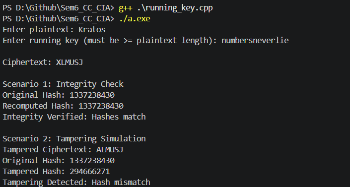

# Running Key Cipher + Hash Integrity Verification

## Overview

This project demonstrates a combination of:

- Running Key Cipher (for encryption)
- FNV-1a Hash Function (for integrity verification)

It showcases two scenarios:

1. Integrity Verification — ensuring data has not been altered  
2. Tampering Detection — detecting changes using hash mismatch  

---

## Concepts Used

### 1. Running Key Cipher

The Running Key Cipher is a polyalphabetic cipher defined as:

C_i = (P_i + K_i) mod 26

Where:
- P_i: plaintext character
- K_i: key character
- C_i: ciphertext character

---

### 2. FNV-1a Hash Function

FNV-1a is a fast, non-cryptographic hash function.

Algorithm:
hash = (hash XOR byte) * prime

Constants:
- Offset basis: 2166136261
- Prime: 16777619

---

## ⚙️ Implementation

### 🔹 Encryption (Running Key)

```cpp
string encryptRunningKey(string plaintext, string key) {
    plaintext = cleanText(plaintext);
    key = cleanText(key);

    string ciphertext = "";

    for (int i = 0; i < plaintext.length(); i++) {
        int p = plaintext[i] - 'A';
        int k = key[i] - 'A';
        ciphertext += char('A' + (p + k) % 26);
    }

    return ciphertext;
}
```

---

### 🔹 FNV-1a Hash

```cpp
uint32_t fnv1a(string text) {
    uint32_t hash = 2166136261u;
    const uint32_t prime = 16777619u;

    for (char c : text) {
        hash ^= (unsigned char)c;
        hash *= prime;
    }

    return hash;
}
```
---

## Scenario 1: Integrity Verification

- Compute hash
- Recompute hash
- Compare both values

If equal → integrity preserved

---

## Scenario 2: Tampering Detection

- Modify ciphertext
- Recompute hash
- Compare with original

If different → tampering detected

---

## Output Screenshot




---

## How to Run

Compile:
g++ running_key.cpp

Run:
./a.exe

---

## Summary

- Encryption ensures confidentiality
- Hashing ensures integrity
- Small changes produce large hash differences